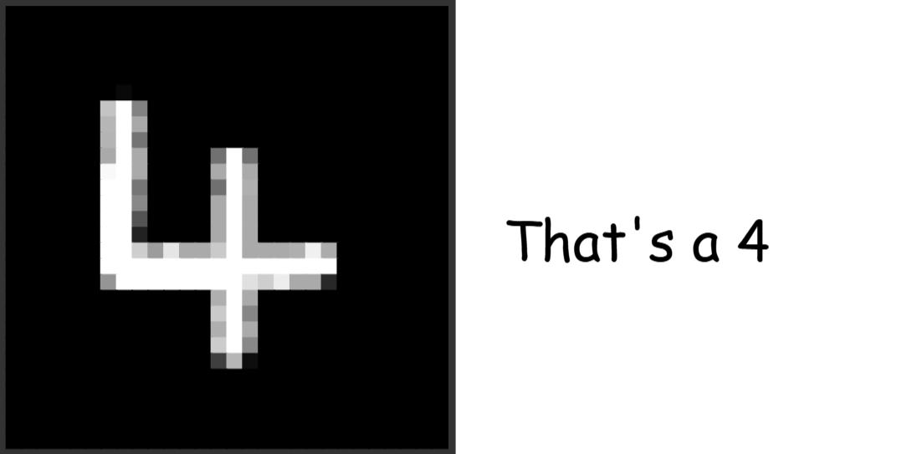
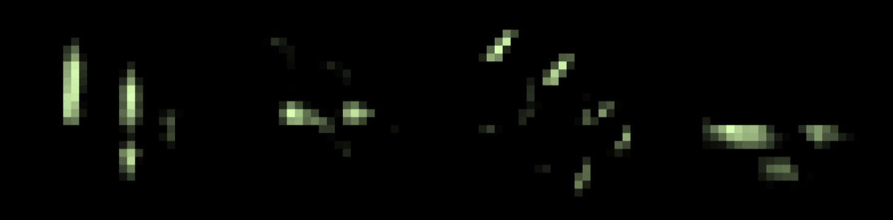

# I trapped an AI in a calculator.
# Here's how I did it

## The graph
https://www.desmos.com/calculator/i9pwenswgj

## How it works
The model consists of one convolutional layer with a 5x5x4 kernel, two max pooling layers, three fully connected layers, and a softmax output layer.
The input is a 28x28 image of a handwritten digit, and the output is a prediction of which digit it is.
Each layer is implemented in Desmos using a combination of functions and lists.
The convolutional layer uses a kernel to convolve the input image, the max pooling layers downsample the feature maps, and the fully connected layers compute the final prediction.
The model is trained using the MNIST dataset in Python Keras.

     
    Yes, yes it is.  
     
    This looks less like a 4. (But it still is!)

## Progress Updates
### 2025-08-15 20:04: https://www.desmos.com/calculator/5u33fv55jd
Able to draw numbers in the graph. Better hope it's a nine because that's all it ever says.

### 2025-08-15 23:49: https://www.desmos.com/calculator/uvgmnkgtgk
Added a basic kernel system. Also added draw and clear buttons.

### 2025-08-16 01:32: https://www.desmos.com/calculator/l0myxs7wb6
Vastly improved the drawing system with antialiasing.

### 2025-08-16 10:40: https://www.desmos.com/calculator/nadsjwfvoc
Convolutions system and MaxPool2D.

### 2025-08-16 12:22: https://www.desmos.com/calculator/zf6bgbivra
Added all the layers, relu, and softmax. Now it thinks everything is a seven though.

### 2025-08-16 18:11: https://www.desmos.com/calculator/q25rrksqvf
Fixed all the bugs and added a prediction display.

### 2025-08-17 11:23: https://www.desmos.com/calculator/crfocxf2l8
Clean up and optimisation.

### 2025-08-17 13:29: https://www.desmos.com/calculator/n1j1scpjtn
Optimisations and aligning the output display.

## References
- [Desmos Graphing Calculator](https://www.desmos.com/calculator)
- [Keras Documentation](https://keras.io/)
- [MNIST Dataset](http://yann.lecun.com/exdb/mnist/)
- [Handwritten Digit Recognition: A Beginner’s Guide](https://amustafa4983.medium.com/handwritten-digit-recognition-a-beginners-guide-638e0995c826)
- [I Made an AI with just Redstone!](https://github.com/mattbatwings/neuralnetwork)
- No AI generated code was used in the making of this project.